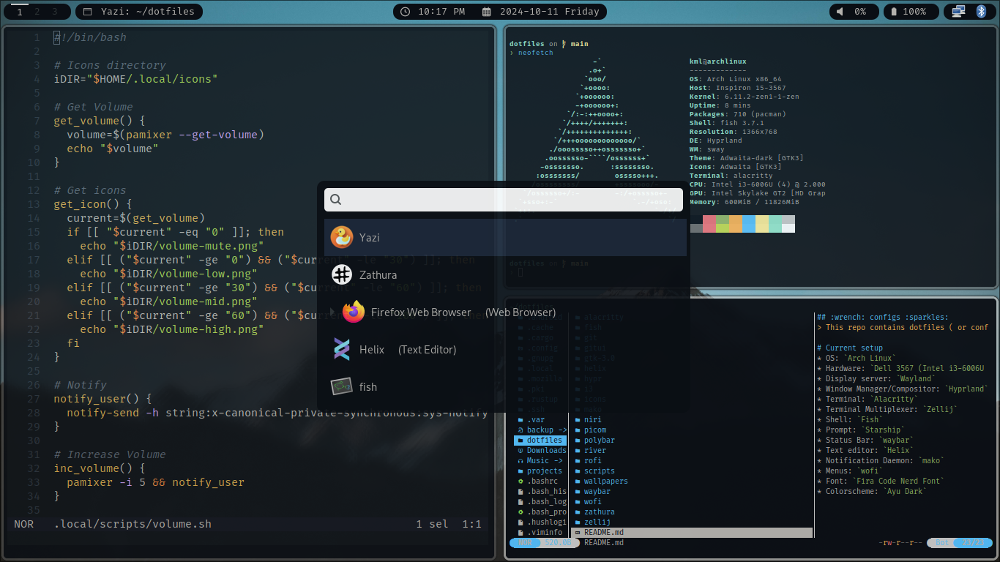

## :wrench: configs :sparkles:
> This repo contains dotfiles ( or configs) of various programs and tools that I use in Linux.

# Current setup
* OS: `Arch Linux`
* Hardware: `Dell 3567 (Intel i3-6006U x86_64)`
* Display server: `Wayland`
* Window Manager/Compositor: `Hyprland`
* Terminal: `Alacritty`
* Terminal Multiplexer: `Zellij`
* Shell: `Fish`
* Prompt: `Starship`
* Status Bar: `waybar`
* Text editor: `Helix`
* Notification Daemon: `mako`
* Menus: `wofi`
* Font: `Fira Code Nerd Font`
* Colorscheme: `Ayu Dark`

# screenshot

